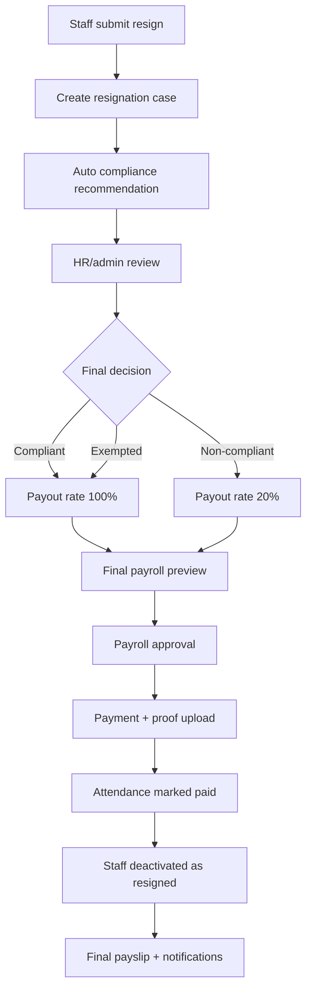

# PRD Pemotongan Gaji Karyawan Resign Tidak Sesuai Prosedur

Versi: 1.0 draft  
Tanggal: 2026-07-01  
Basis kode: Next.js 15, Supabase, API catch-all `app/api/[[...path]]/route.ts`, modul staff, attendance, payroll, payslip, email log, dan payroll projection.

## 1. Latar Belakang

Sistem staff portal saat ini sudah memiliki modul karyawan, absensi, jadwal, cuti/libur, payroll, bukti pembayaran, dan slip gaji. Namun belum ada domain khusus untuk pengunduran diri karyawan.

Kondisi codebase saat ini:

- Data karyawan disimpan di tabel `staff`.
- Status operasional karyawan hanya dibedakan dengan `staff.active`, `deleted_at`, `deleted_by`, `delete_reason`, dan `archived_at`.
- Aksi admin staff saat ini mendukung tambah/edit, nonaktif, arsip, dan hard delete melalui `/api/admin/staff`.
- Tidak ada tabel `resignations`, `employee_status`, `last_working_date`, `notice_period`, atau approval resign.
- Gaji terbentuk per absensi di `attendance.final_salary`.
- `attendance.final_salary` dihitung dari `staff.salary_per_shift`, keterlambatan, config `late_tolerance_minutes`, dan `deduction_per_minute`.
- Full shift di outlet dua shift memakai flag `FULL_SHIFT_2X` dan gaji efektif `salary_per_shift * 2`.
- Payroll hanya menghitung shift yang lengkap: harus ada `checkin_time` dan `checkout_time`.
- Pembayaran payroll disimpan di `payments`.
- `payments.amount` saat ini berarti total gaji shift yang ditandai lunas, bukan nominal net yang benar-benar diterima.
- Bonus dan potongan manual ada di `payments.bonus`, `payments.bonus_note`, `payments.deduction`, dan `payments.deduction_note`.
- Slip gaji menampilkan gaji shift, bonus, potongan, dan total diterima sebagai `amount + bonus - deduction`.
- Payroll projection memakai staff aktif dan data `attendance.final_salary` untuk estimasi cash flow.

Business rule baru:

- Jika karyawan resign sesuai prosedur, gaji terakhir dibayar 100% seperti biasa.
- Jika karyawan resign tidak sesuai prosedur, gaji terakhir yang dibayarkan hanya 20% dari gaji penuh.

Catatan kepatuhan:

- Referensi awal untuk review HR/legal: PP No. 35 Tahun 2021 dan UU No. 13 Tahun 2003 di database Peraturan BPK memuat syarat pengunduran diri tertulis paling lambat 30 hari sebelum tanggal mulai pengunduran diri.
- Link awal:
  - PP No. 35 Tahun 2021: https://peraturan.bpk.go.id/Details/161904/pp-no-35-tahun-2021
  - PDF PP No. 35 Tahun 2021: https://peraturan.bpk.go.id/Download/154582/PP%20Nomor%2035%20Tahun%202021.pdf
  - PDF UU No. 13 Tahun 2003: https://peraturan.bpk.go.id/Download/31128/UU%20Nomor%2013%20Tahun%202003.pdf
- PRD ini tidak menetapkan opini hukum. Kebijakan "hanya dibayar 20%" wajib disetujui oleh HR/legal/perusahaan sebelum implementasi produksi.

## 2. Tujuan

1. Memberi admin/HR alat resmi untuk mencatat proses resign karyawan.
2. Menentukan apakah resign sesuai prosedur atau tidak sesuai prosedur secara terstruktur dan ter-audit.
3. Menghitung payroll terakhir dengan payout 100% atau 20% sesuai status resign.
4. Menampilkan alasan dan rincian pemotongan secara transparan di admin payroll, staff payroll, dan slip gaji.
5. Menghindari penggunaan `delete_reason` bebas sebagai sumber kebenaran resign.
6. Menjaga histori absensi/payroll tetap utuh walaupun karyawan sudah resign/nonaktif.
7. Mencegah payroll report dan slip gaji salah menampilkan nominal transfer karena `payments.amount` saat ini adalah gross shift amount.

## 3. Ruang Lingkup

### 3.1 In-scope MVP

- Membuat domain resign terpisah dari delete/archive staff.
- Admin/HR dapat membuat dan memproses kasus resign.
- Staff dapat mengajukan resign dari portal staff, atau admin dapat membuat resign atas nama staff jika pengajuan dilakukan offline.
- Sistem menghitung rekomendasi compliance berdasarkan tanggal pengajuan, tanggal resign efektif, dan notice period.
- HR/admin tetap menjadi penentu final status `sesuai prosedur` atau `tidak sesuai prosedur`.
- Perhitungan payroll final:
  - compliant = 100% dari eligible final salary.
  - non-compliant = 20% dari eligible final salary.
- Potongan resign muncul sebagai komponen terpisah di pratinjau payroll dan slip gaji.
- Staff yang sudah final resign dinonaktifkan dari login operasional setelah final payroll disetujui atau setelah tanggal efektif resign.
- Audit log untuk create, review, override, approve payroll final, dan payment.
- Notifikasi email untuk HR/admin dan staff memakai infrastruktur `email_logs`.

### 3.2 Out-of-scope MVP

- Implementasi kode pada tahap PRD ini.
- Approval multi-level dengan role HR dan Finance terpisah. Sistem saat ini hanya punya role `admin`; pemisahan role bisa fase lanjut.
- Perhitungan THR, pajak PPh, BPJS, pesangon, uang kompensasi PKWT, atau hak normatif lain yang belum ada di sistem.
- Integrasi tanda tangan digital surat resign.
- Workflow dispute/banding formal.
- Reversal otomatis transfer bank.
- Integrasi payroll eksternal.
- Perubahan legal policy perusahaan. PRD hanya memodelkan business rule yang diberikan.

## 4. Source Code Yang Ditinjau

- `types/domain.ts`
- `lib/business.ts`
- `lib/payroll.ts`
- `lib/payroll-projection.ts`
- `lib/attendance-import.ts`
- `components/payroll/payroll-ui.tsx`
- `components/payroll/payslip-view.tsx`
- `components/staff/payroll-rule-notice.tsx`
- `app/api/[[...path]]/route.ts`
- `app/(admin)/admin/staff/page.tsx`
- `app/(admin)/admin/payroll/page.tsx`
- `app/(staff)/app/payroll/page.tsx`
- `supabase/migrations/0001_initial_schema.sql`
- `supabase/migrations/0003_prd_v1.sql`
- `supabase/migrations/0004_email_notifications.sql`
- `supabase/migrations/0007_payroll_projection.sql`
- `supabase/migrations/0012_payroll_bonus.sql`
- `supabase/migrations/0013_payroll_deduction.sql`

## 5. User Story

### 5.1 Staff

Sebagai staff, saya ingin mengajukan resign dengan tanggal terakhir bekerja dan alasan resign agar HR dapat memvalidasi status saya secara resmi.

Sebagai staff, saya ingin melihat apakah resign saya dinilai sesuai prosedur atau tidak agar saya mengetahui dampak ke gaji terakhir.

Sebagai staff, saya ingin melihat rincian gaji terakhir dan potongan resign di slip gaji agar nominal yang saya terima transparan.

### 5.2 HR/Admin

Sebagai HR/admin, saya ingin membuat atau menerima pengajuan resign agar proses resign tidak lagi dicatat hanya sebagai nonaktif/arsip staff.

Sebagai HR/admin, saya ingin sistem menghitung rekomendasi notice period otomatis agar review lebih cepat dan konsisten.

Sebagai HR/admin, saya ingin dapat override status compliance dengan alasan wajib karena ada kasus yang tidak bisa ditentukan dari tanggal saja.

Sebagai HR/admin, saya ingin melihat pratinjau payroll final dengan payout 100% atau 20% sebelum pembayaran agar tidak salah transfer.

### 5.3 Owner/Finance

Sebagai owner/finance, saya ingin laporan payroll membedakan gross salary, potongan resign, dan net transfer agar cash out dan laporan internal akurat.

## 6. Definisi Produk

### 6.1 Resign Sesuai Prosedur

Dalam PRD ini, resign dianggap sesuai prosedur jika semua kondisi berikut terpenuhi:

1. Staff mengajukan resign tertulis melalui sistem atau surat resmi yang diunggah/dicatat admin.
2. Tanggal pengajuan memenuhi notice period minimum.
3. Staff bekerja sampai tanggal terakhir yang disetujui HR/admin, kecuali HR/admin menyetujui pengecualian.
4. Tidak ada status abandonment/no-show yang diputuskan HR/admin untuk kasus tersebut.
5. HR/admin memberi final approval `compliant`.

### 6.2 Resign Tidak Sesuai Prosedur

Resign dianggap tidak sesuai prosedur jika satu atau lebih kondisi berikut terjadi:

1. Notice period kurang dari minimum yang berlaku.
2. Tidak ada surat resign resmi atau catatan pengajuan resmi.
3. Staff berhenti bekerja sebelum tanggal terakhir yang disetujui tanpa approval HR/admin.
4. Staff menghilang/no-show tanpa komunikasi pada minimal 2 jadwal kerja berturut-turut, lalu HR/admin menandai kasus sebagai abandonment.
5. Staff menolak atau tidak menyelesaikan handover wajib yang ditentukan perusahaan, jika handover tersebut memang dijadikan policy tertulis.
6. HR/admin memberi final approval `non_compliant`.

### 6.3 Asumsi Notice Period

Asumsi MVP:

- Default notice period: 30 hari kalender.
- Nilai ini harus configurable melalui `config.resignation_notice_days`.
- Untuk masa probation, default MVP tetap 30 hari sampai HR/legal menetapkan nilai khusus.
- Jika perusahaan ingin probation berbeda, gunakan config tambahan `resignation_notice_days_probation`, contoh 7 hari kalender.
- Perhitungan notice days = jumlah hari kalender dari tanggal pengajuan sampai tanggal resign efektif.
- Tanggal pengajuan dihitung dari:
  - `submitted_at` jika staff submit dari portal, atau
  - `letter_received_at` jika admin mencatat surat resign offline.

### 6.4 Siapa Menentukan Status Sesuai/Tidak Sesuai

Model keputusan: hybrid.

- Sistem menghitung rekomendasi otomatis:
  - `auto_compliant` jika notice days >= required days dan surat resmi ada.
  - `auto_non_compliant` jika notice days < required days atau surat resmi tidak ada.
  - `needs_review` jika data belum lengkap.
- HR/admin wajib menetapkan status final:
  - `compliant`
  - `non_compliant`
  - `exempted`
  - `cancelled`
- Status final tidak boleh berubah setelah final payroll dibayar, kecuali melalui flow reversal/adjustment baru.
- Override dari rekomendasi sistem wajib mengisi alasan.

### 6.5 Komponen Gaji Yang Terkena Payout 20%

Karena sistem payroll saat ini berbasis shift, komponen yang terkena aturan 20% pada MVP adalah:

- Eligible final salary = total `attendance.final_salary` yang belum dibayar dan shift-nya lengkap (`checkin_time` dan `checkout_time` ada) sampai tanggal resign efektif.
- `attendance.final_salary` sudah mencerminkan:
  - gaji per shift,
  - potongan keterlambatan,
  - full shift 2x jika ada flag `FULL_SHIFT_2X`,
  - revisi manual admin pada attendance.

Komponen yang tidak terkena aturan 20% pada MVP:

- Bonus manual di `payments.bonus`.
- Reimbursement atau penggantian biaya, karena belum ada modelnya di sistem.
- THR, BPJS, PPh, pesangon, kompensasi PKWT, atau hak normatif lain, karena belum ada modulnya di sistem.
- Attendance yang sudah pernah dibayar sebelum kasus resign final.
- Shift yang tidak lengkap check-in/checkout, karena saat ini memang tidak dihitung sebagai gaji.

Jika perusahaan ingin bonus juga terkena potongan 20%, itu harus menjadi konfigurasi terpisah (`resignation_apply_to_bonus=true`) dan perlu approval HR/legal. Default MVP: bonus tidak ikut dipotong otomatis.

### 6.6 Formula Payroll Final

Untuk kasus resign:

```text
eligible_base = sum(unpaid counted attendance.final_salary sampai last_working_date)
payout_rate = 1.00 jika compliant, 0.20 jika non_compliant
resignation_policy_deduction = round(eligible_base * (1 - payout_rate))
manual_deduction = potongan lain yang diinput admin, misalnya kasbon
bonus = bonus final yang diinput admin
net_transfer = eligible_base - resignation_policy_deduction - manual_deduction + bonus
```

Contoh non-compliant:

```text
eligible_base = Rp1.000.000
payout_rate = 20%
resignation_policy_deduction = Rp800.000
bonus = Rp0
manual_deduction = Rp0
net_transfer = Rp200.000
```

Catatan penting untuk codebase:

- `payments.amount` saat ini dipakai untuk menandai shift lunas dan menghitung summary.
- Untuk final resign, `payments.amount` tetap harus menyimpan `eligible_base` agar shift bisa ditandai lunas.
- UI/API/report wajib menampilkan `net_transfer`, bukan hanya `payments.amount`, agar nominal transfer tidak terlihat seolah 100%.

## 7. Business Rules & Logic

### 7.1 Status Resignation Case

Status kasus resign:

- `draft`: dibuat admin tapi belum diajukan/final.
- `submitted`: diajukan staff atau dicatat admin.
- `under_review`: HR/admin sedang validasi.
- `approved_compliant`: resign disetujui dan sesuai prosedur.
- `approved_non_compliant`: resign disetujui tetapi tidak sesuai prosedur.
- `exempted`: resign diberi pengecualian, payout 100% walau data notice tidak memenuhi.
- `withdrawn`: staff membatalkan pengajuan sebelum approval.
- `cancelled`: admin membatalkan case karena salah input/duplikat.
- `final_payroll_approved`: payroll final sudah disetujui tetapi belum dibayar.
- `paid`: final payroll sudah dibayar.

### 7.2 Rate Payout

Mapping payout:

| Final status | Payout rate | Keterangan |
| --- | ---: | --- |
| `approved_compliant` | 100% | Resign sesuai prosedur |
| `exempted` | 100% | Ada pengecualian admin/HR |
| `approved_non_compliant` | 20% | Resign tidak sesuai prosedur |
| status lain | tidak boleh payroll final | Harus review dulu |

### 7.3 Validasi Pengajuan Resign

Pengajuan resign harus memiliki:

- `staff_id`
- `submitted_at` atau `letter_received_at`
- `requested_last_working_date`
- alasan resign
- bukti surat resign atau checkbox `written_notice_received`

Validasi:

- Tidak boleh ada lebih dari satu active resignation case untuk staff yang sama.
- `requested_last_working_date` tidak boleh sebelum `submitted_at` kecuali HR/admin membuat case abandonment/manual.
- Staff dengan `deleted_at` tidak boleh membuat resign baru.
- Staff nonaktif boleh diproses final payroll resign jika ada case yang dibuat sebelum nonaktif atau dibuat admin dengan alasan.

### 7.4 Validasi Compliance Otomatis

Sistem menghitung:

```text
notice_given_days = difference_in_calendar_days(effective_resign_date, submitted_or_received_date)
required_notice_days = config by employment status
has_written_notice = written_notice_received or resignation_letter_url exists
```

Rekomendasi:

- Jika `has_written_notice=false`: `auto_non_compliant`.
- Jika `notice_given_days < required_notice_days`: `auto_non_compliant`.
- Jika `notice_given_days >= required_notice_days` dan surat ada: `auto_compliant`.
- Jika data tanggal/surat belum lengkap: `needs_review`.

### 7.5 Final Payroll Eligibility

Payroll final hanya boleh dibuat jika:

1. Resignation case status adalah `approved_compliant`, `approved_non_compliant`, atau `exempted`.
2. Tidak ada final payment sebelumnya untuk case tersebut.
3. Ada setidaknya satu unpaid counted attendance, atau HR/admin mengonfirmasi final payroll nol.
4. Tanggal payroll final tidak melebihi kebijakan cutoff yang ditentukan admin.
5. Semua shift yang dipilih memiliki `paid_status=false`.

### 7.6 Staff Deactivation

Setelah resign final:

- Staff tidak boleh lagi login sebagai staff aktif.
- `staff.active=false`.
- `staff.employment_status='resigned'` jika kolom baru diimplementasikan.
- `staff.resigned_at` dan `staff.last_working_date` diisi untuk reporting.
- Tidak otomatis hard delete atau archive.
- `deleted_at` tetap hanya untuk archive/delete, bukan penanda resign utama.

### 7.7 Perubahan Setelah Payroll Dibayar

Jika HR/admin mengubah status dari non-compliant ke compliant setelah pembayaran:

- Sistem tidak boleh mengubah payment lama secara diam-diam.
- Harus ada adjustment payment tambahan atau reversal flow.
- Audit log harus menyimpan alasan perubahan.

## 8. Alur Proses

### 8.1 Flow Utama

```text
Staff ajukan resign
  -> Sistem simpan resignation case
  -> Sistem hitung rekomendasi compliance
  -> HR/admin review dokumen, tanggal, dan kriteria
  -> HR/admin menetapkan compliant / non-compliant / exempted
  -> Sistem hitung final payroll preview
  -> HR/admin approve final payroll
  -> Admin/finance upload bukti pembayaran
  -> Sistem simpan payment dan tandai attendance lunas
  -> Sistem nonaktifkan staff setelah finalisasi
  -> Staff menerima notifikasi dan dapat melihat slip gaji final
```

### 8.2 Diagram Sederhana



### 8.3 Flow Manual Jika Staff Resign Mendadak/Offline

1. Staff memberi kabar offline atau tidak masuk.
2. HR/admin membuka halaman resign dan memilih staff.
3. HR/admin membuat case `submitted` dengan source `admin_entry`.
4. Jika tidak ada surat resmi, HR/admin set `written_notice_received=false`.
5. Sistem memberi rekomendasi `auto_non_compliant`.
6. HR/admin dapat approve `approved_non_compliant` atau `exempted` dengan alasan.
7. Final payroll dihitung sesuai decision.

### 8.4 Flow Probation

1. Staff probation submit resign.
2. Sistem cek `staff.employment_type` atau `employment_status_detail` jika tersedia.
3. Jika config probation tersedia, gunakan `resignation_notice_days_probation`.
4. Jika config belum tersedia, fallback ke `resignation_notice_days`.
5. HR/admin tetap harus review final.

## 9. Perubahan Teknis

### 9.1 Data Model Baru

#### 9.1.1 Tabel `resignation_cases`

Usulan tabel:

```sql
CREATE TABLE resignation_cases (
  id UUID PRIMARY KEY DEFAULT gen_random_uuid(),
  staff_id UUID NOT NULL REFERENCES staff(id),
  staff_name TEXT NOT NULL,
  outlet_id UUID REFERENCES outlets(id),
  outlet_name TEXT,
  source TEXT NOT NULL CHECK (source IN ('staff_portal','admin_entry','abandonment')),
  status TEXT NOT NULL CHECK (status IN (
    'draft',
    'submitted',
    'under_review',
    'approved_compliant',
    'approved_non_compliant',
    'exempted',
    'withdrawn',
    'cancelled',
    'final_payroll_approved',
    'paid'
  )),
  submitted_at TIMESTAMPTZ,
  letter_received_at TIMESTAMPTZ,
  requested_last_working_date DATE NOT NULL,
  approved_last_working_date DATE,
  effective_resign_date DATE,
  notice_required_days INTEGER NOT NULL DEFAULT 30,
  notice_given_days INTEGER,
  written_notice_received BOOLEAN NOT NULL DEFAULT false,
  resignation_letter_url TEXT,
  reason TEXT,
  auto_compliance_status TEXT CHECK (auto_compliance_status IN ('auto_compliant','auto_non_compliant','needs_review')),
  final_compliance_status TEXT CHECK (final_compliance_status IN ('compliant','non_compliant','exempted')),
  compliance_reason TEXT,
  reviewed_by TEXT,
  reviewed_at TIMESTAMPTZ,
  final_payroll_payment_id UUID REFERENCES payments(id),
  created_by TEXT,
  created_at TIMESTAMPTZ NOT NULL DEFAULT now(),
  updated_at TIMESTAMPTZ NOT NULL DEFAULT now()
);
```

Index:

- `idx_resignation_cases_staff_created_at` on `(staff_id, created_at DESC)`.
- `idx_resignation_cases_status` on `(status)`.
- Unique partial index active case per staff:

```sql
CREATE UNIQUE INDEX ux_resignation_active_staff
ON resignation_cases(staff_id)
WHERE status IN ('draft','submitted','under_review','approved_compliant','approved_non_compliant','exempted','final_payroll_approved');
```

#### 9.1.2 Kolom Baru Di `staff`

Usulan additive columns:

```sql
ALTER TABLE staff
  ADD COLUMN employment_status TEXT NOT NULL DEFAULT 'active'
    CHECK (employment_status IN ('active','resigning','resigned','inactive','archived')),
  ADD COLUMN resigned_at TIMESTAMPTZ,
  ADD COLUMN last_working_date DATE,
  ADD COLUMN resignation_case_id UUID REFERENCES resignation_cases(id);
```

Mapping backward compatibility:

- `active=true` dan `deleted_at IS NULL` -> `employment_status='active'`.
- `active=false` dan `deleted_at IS NULL` tanpa resign case -> `employment_status='inactive'`.
- `deleted_at IS NOT NULL` -> `employment_status='archived'`.
- Resign final -> `employment_status='resigned'`.

#### 9.1.3 Kolom Baru Di `payments`

Usulan additive columns:

```sql
ALTER TABLE payments
  ADD COLUMN payment_kind TEXT NOT NULL DEFAULT 'regular'
    CHECK (payment_kind IN ('regular','final_resignation')),
  ADD COLUMN resignation_case_id UUID REFERENCES resignation_cases(id),
  ADD COLUMN payout_rate NUMERIC(5,2) NOT NULL DEFAULT 1.00,
  ADD COLUMN resignation_policy_deduction NUMERIC(12,0) NOT NULL DEFAULT 0,
  ADD COLUMN manual_deduction NUMERIC(12,0) NOT NULL DEFAULT 0,
  ADD COLUMN net_transfer_amount NUMERIC(12,0);
```

Catatan:

- `payments.deduction` tetap dapat dipakai sebagai total deduction untuk backward compatibility.
- Untuk final resign, `payments.deduction = resignation_policy_deduction + manual_deduction`.
- `net_transfer_amount = amount + bonus - deduction`.
- Jika `net_transfer_amount` tidak disimpan, API wajib menghitung konsisten.

#### 9.1.4 Config Baru

Tambahkan config:

```text
resignation_notice_days = 30
resignation_notice_days_probation = 30
resignation_non_compliant_payout_rate = 0.20
resignation_apply_to_bonus = false
resignation_no_show_threshold_workdays = 2
```

### 9.2 Perubahan TypeScript Domain

Tambahkan type:

- `ResignationCase`
- `ResignationCaseStatus`
- `ResignationComplianceStatus`
- `PayrollPayment.payment_kind`
- `PayrollPayment.resignation_case_id`
- `PayrollPayment.payout_rate`
- `PayrollPayment.resignation_policy_deduction`
- `PayrollPayment.net_transfer_amount`
- `Staff.employment_status`
- `Staff.resigned_at`
- `Staff.last_working_date`
- `Staff.resignation_case_id`

### 9.3 API/Endpoint Baru

#### Staff endpoints

`GET /api/staff/resignation`

- Mengambil active resignation case staff login.
- Mengembalikan status, rekomendasi, final decision, last working date, dan payroll final jika sudah ada.

`POST /api/staff/resignation`

- Staff mengajukan resign.
- Body:
  - `requestedLastWorkingDate`
  - `reason`
  - `letterFile` atau `letterUrl` opsional
- Server menghitung rekomendasi compliance.
- Status awal `submitted`.

`POST /api/staff/resignation/withdraw`

- Staff membatalkan pengajuan sebelum HR/admin final approval.

#### Admin endpoints

`GET /api/admin/resignations`

- List resignation case.
- Filter: status, outlet, staff, date range, compliance.

`POST /api/admin/resignations`

- Admin membuat case atas nama staff.
- Dipakai untuk pengajuan offline, resign mendadak, atau abandonment.

`PUT /api/admin/resignations`

- Update tanggal, dokumen, reason, atau status review.
- Body minimal:
  - `resignationCaseId`
  - fields yang berubah
  - `reviewNote` jika update status.

`POST /api/admin/resignations/review`

- HR/admin menetapkan final compliance.
- Body:
  - `resignationCaseId`
  - `finalComplianceStatus`
  - `approvedLastWorkingDate`
  - `complianceReason`

`POST /api/admin/resignations/final-payroll-preview`

- Menghasilkan preview eligible attendance, eligible base, payout rate, deduction, bonus/manual deduction, dan net transfer.
- Tidak menulis payment.

`POST /api/admin/resignations/final-payroll-approve`

- Mengunci payroll final sebelum pembayaran.
- Status case menjadi `final_payroll_approved`.

`POST /api/admin/resignations/final-payroll-pay`

- Membuat `payments` dengan `payment_kind='final_resignation'`.
- Menandai attendance yang dipilih `paid_status=true`.
- Mengisi `resignation_cases.final_payroll_payment_id`.
- Menonaktifkan staff sesuai policy.

### 9.4 API Existing Yang Terdampak

`GET /api/admin/staff`

- Tambahkan field resignation/employment status.
- UI harus membedakan `Nonaktif`, `Resigned`, dan `Arsip`.

`DELETE /api/admin/staff`

- Tidak boleh menjadi flow utama resign.
- Jika alasan archive mengandung resign, UI harus menyarankan membuat resignation case dulu.

`GET /api/admin/payroll`

- Harus expose `netTransferAmount`, `payment_kind`, dan resignation deduction.
- Staff resigned tetap bisa dipilih untuk final payroll walau `active=false`, selama belum archived.

`POST /api/admin/payroll`

- Untuk final resign, harus menerima `resignationCaseId`.
- Harus menolak pembayaran regular jika staff punya case final payroll yang wajib diproses sebagai resignation payroll.
- Harus mencegah double payment final.

`GET /api/staff/payroll`

- Harus expose payment net/gross breakdown.
- Jika staff memiliki resignation case aktif, tampilkan status dan estimasi dampak payroll bila sudah final.

`GET /api/payslip`

- Harus expose:
  - `payment_kind`
  - `payout_rate`
  - `resignation_policy_deduction`
  - `manual_deduction`
  - `net_transfer_amount`
  - `resignation_case`
- Slip gaji final harus menampilkan "Potongan resign tidak sesuai prosedur" terpisah dari potongan telat/kasbon.

`GET /api/admin/payroll-projection`

- Staff `resigning` atau `resigned` perlu status khusus.
- Proyeksi cash need harus memakai `net_transfer_amount` atau payout rate final jika case sudah approved.

`POST /api/admin/attendance` dan import attendance

- Harus memberi warning/block jika admin membuat attendance setelah `last_working_date` staff resigned.

### 9.5 UI Yang Terdampak

Admin:

- Menu baru `Resignasi` atau sub-menu di `Manajemen Staff`.
- Halaman detail resignation case.
- Badge status resign di tabel staff.
- Payroll final preview di halaman payroll atau detail resignation.
- Slip gaji final resignation.

Staff:

- Halaman/form pengajuan resign.
- Status pengajuan resign.
- Info final payroll dan slip gaji final.
- Notifikasi atau banner jika resign dinilai non-compliant.

Payroll components:

- `PayrollHero`: bedakan gross paid vs net received, khususnya final resign.
- `PayrollPaymentCard`: tampilkan payment kind, payout rate, resignation deduction, dan net transfer.
- `PayslipView`: tampilkan komponen "Gaji final eligible", "Payout rate", "Potongan resign", dan "Total diterima".

## 10. Notifikasi

### 10.1 Ke HR/Admin

Kirim notifikasi ketika:

- Staff mengajukan resign baru.
- Sistem memberi rekomendasi `auto_non_compliant`.
- Tanggal efektif resign kurang dari notice period.
- Final payroll resign siap direview.
- Ada percobaan pembayaran regular untuk staff yang punya active resignation case.

Channel MVP:

- Email ke `notification_email`.
- Entry di `email_logs`.
- Optional badge/count di dashboard admin.

### 10.2 Ke Staff

Kirim notifikasi ketika:

- Pengajuan resign diterima sistem.
- HR/admin menetapkan status compliant/non-compliant/exempted.
- Final payroll disetujui.
- Pembayaran final dicatat dan slip gaji tersedia.
- Pengajuan ditolak/dibatalkan/withdrawn.

Isi notifikasi staff harus jelas:

- Status resign.
- Tanggal terakhir bekerja yang disetujui.
- Payout rate 100% atau 20%.
- Alasan jika non-compliant.
- Link ke detail/slip setelah dibayar.

## 11. Acceptance Criteria

### 11.1 Pengajuan Resign Sesuai Prosedur

Given staff aktif mengajukan resign pada 2026-07-01 dengan tanggal efektif 2026-07-31  
And notice period config adalah 30 hari  
And surat resign resmi tersedia  
When HR/admin approve sebagai compliant  
Then sistem menetapkan payout rate 100%  
And final payroll preview menampilkan resignation deduction Rp0  
And payment final menampilkan net transfer sama dengan eligible base plus bonus minus manual deduction.

### 11.2 Resign Mendadak

Given staff mengajukan resign pada 2026-07-01 untuk tanggal efektif 2026-07-01  
When sistem menghitung notice days  
Then rekomendasi adalah `auto_non_compliant`  
And HR/admin dapat approve `approved_non_compliant` dengan alasan wajib  
And final payroll payout rate adalah 20%  
And slip gaji menampilkan potongan resign 80% dari eligible base.

### 11.3 Tanpa Surat Resign Resmi

Given staff memberi kabar resign via chat tetapi tidak ada surat resmi  
When admin membuat resignation case dengan `written_notice_received=false`  
Then rekomendasi sistem adalah `auto_non_compliant`  
And admin tetap dapat override ke `exempted` hanya dengan alasan wajib.

### 11.4 Probation

Given staff dalam masa probation  
And config `resignation_notice_days_probation=7`  
When staff mengajukan resign 10 hari sebelum tanggal efektif  
Then rekomendasi sistem adalah `auto_compliant`  
And HR/admin tetap harus menetapkan final decision sebelum payroll final.

### 11.5 Probation Tanpa Config Khusus

Given staff dalam masa probation  
And config probation belum diset  
When staff mengajukan resign 10 hari sebelum tanggal efektif  
Then sistem memakai default `resignation_notice_days`  
And rekomendasi mengikuti default tersebut  
And UI menampilkan warning bahwa probation notice memakai default policy.

### 11.6 Staff No-show / Abandonment

Given staff tidak hadir pada 2 jadwal kerja berturut-turut tanpa komunikasi  
When admin membuat resignation case dengan source `abandonment`  
Then sistem tidak otomatis final payroll  
And admin wajib memilih final compliance status dan alasan  
And jika non-compliant, payout rate 20%.

### 11.7 Shift Belum Checkout

Given staff punya attendance dengan checkin tetapi belum checkout  
When final payroll preview dibuat  
Then attendance tersebut tidak masuk eligible base  
And UI menampilkan excluded reason "shift tidak lengkap".

### 11.8 Shift Sudah Dibayar Sebelumnya

Given staff punya attendance yang sudah `paid_status=true` sebelum resign  
When final payroll preview dibuat  
Then attendance tersebut tidak terkena potongan resign  
And hanya unpaid counted attendance yang dihitung.

### 11.9 Full Shift 2x

Given attendance memiliki flag `FULL_SHIFT_2X` dan `final_salary` sudah 2x  
When final payroll resign non-compliant dihitung  
Then eligible base memakai `attendance.final_salary` aktual  
And payout 20% dihitung dari nominal tersebut.

### 11.10 Bonus Final

Given HR/admin menambahkan bonus Rp100.000 pada final payroll non-compliant  
And default `resignation_apply_to_bonus=false`  
When payment disimpan  
Then bonus tidak dipotong otomatis  
And net transfer = 20% eligible base + bonus - manual deduction.

### 11.11 Potongan Manual Lain

Given final payroll non-compliant memiliki kasbon Rp50.000  
When payment disimpan  
Then `resignation_policy_deduction` dan `manual_deduction` tersimpan/terekspos terpisah  
And slip gaji menampilkan kedua potongan dengan label berbeda.

### 11.12 Double Final Payroll

Given resignation case sudah memiliki `final_payroll_payment_id`  
When admin mencoba membuat final payroll lagi untuk case yang sama  
Then API menolak dengan error `FINAL_PAYROLL_ALREADY_PAID`.

### 11.13 Perubahan Status Setelah Payment

Given final payroll non-compliant sudah dibayar  
When admin mencoba mengubah status case menjadi compliant  
Then sistem menolak edit langsung  
And mengarahkan ke flow adjustment/reversal dengan alasan wajib.

### 11.14 Staff Deactivation

Given final payroll resign sudah dibayar  
When proses finalisasi selesai  
Then `staff.active=false`  
And `staff.employment_status='resigned'`  
And staff tidak bisa login operasional  
And histori payroll/slip tetap dapat dilihat oleh admin.

### 11.15 Payroll Summary Net Amount

Given payment final resign non-compliant memiliki `amount=Rp1.000.000` dan `deduction=Rp800.000`  
When admin/staff melihat riwayat pembayaran  
Then UI menampilkan gross shift salary Rp1.000.000  
And potongan resign Rp800.000  
And total diterima Rp200.000  
And tidak menampilkan seolah staff menerima Rp1.000.000.

## 12. Test Case Tambahan

1. Staff aktif submit resign tanpa alasan: API menolak.
2. Staff archived submit resign: API menolak.
3. Admin membuat resign case untuk staff nonaktif yang belum archived: API mengizinkan dengan alasan.
4. Dua active resignation case untuk staff sama: API menolak.
5. Notice days tepat sama dengan required days: compliant recommendation.
6. Notice days kurang 1 hari dari required days: non-compliant recommendation.
7. Requested last working date mundur setelah HR review: sistem hitung ulang rekomendasi.
8. HR/admin override auto-compliant menjadi non-compliant tanpa alasan: API menolak.
9. HR/admin override auto-non-compliant menjadi exempted tanpa alasan: API menolak.
10. Final payroll preview dengan eligible base Rp0: sistem meminta konfirmasi "final payroll nol".
11. Payment proof upload gagal: payment tidak boleh dibuat.
12. Konflik payroll ketika attendance sudah dibayar request lain: payment rollback seperti guard payroll existing.
13. Staff resign tapi ada future schedule: sistem cancel future assignments setelah last working date.
14. Payroll projection tidak memasukkan resigned staff sebagai active cash need normal.
15. Slip gaji final bisa diakses admin setelah staff resigned.

## 13. Dampak Ke Fitur Lain

### 13.1 Payroll Admin

- Perlu mode final resignation payroll.
- Perlu warning jika staff punya resignation case aktif.
- Perlu tampilkan gross, resignation deduction, manual deduction, bonus, dan net transfer.
- Alokasi attendance tetap memakai gross eligible base agar shift dapat ditandai lunas.

### 13.2 Staff Payroll

- Staff harus melihat status final resign dan breakdown potongan.
- Popup aturan payroll yang ada mungkin perlu versi baru jika kebijakan resign perlu acknowledged.

### 13.3 Slip Gaji

- Slip final resign harus menampilkan:
  - status resign,
  - payout rate,
  - eligible base,
  - potongan resign,
  - total diterima.
- Nomor slip dan bukti pembayaran tetap memakai payment id existing.

### 13.4 Payroll Projection

- Staff `resigning` harus diberi label khusus.
- Jika case sudah approved non-compliant, cash need memakai 20% dari eligible unpaid base.
- Jika case belum approved, projection menampilkan risiko range:
  - worst case/non-compliant 20%.
  - normal/compliant 100%.

### 13.5 Staff Management

- Jangan lagi memakai delete/archive sebagai proses resign utama.
- Tabel staff perlu badge `Aktif`, `Resigning`, `Resigned`, `Nonaktif`, `Arsip`.
- Nonaktif biasa tetap tersedia untuk kasus bukan resign.

### 13.6 Attendance dan Schedule

- Future schedule setelah last working date harus dibatalkan.
- Admin attendance manual/import perlu warning jika tanggal setelah last working date.
- Attendance sebelum last working date tetap valid.

### 13.7 Laporan Pajak / Laporan Keuangan

- Saat ini belum ada modul pajak eksplisit.
- Jika laporan pajak/payroll export dibuat, perlu membedakan:
  - gross salary earned,
  - resignation policy deduction,
  - other deductions,
  - net paid.
- Kebijakan apakah potongan 80% dianggap pengurang gaji, penalti, atau komponen lain harus diputuskan HR/legal/accounting.

### 13.8 Audit Log

Audit action baru:

- `staff_resignation_submitted`
- `admin_create_resignation`
- `admin_review_resignation`
- `admin_override_resignation_compliance`
- `admin_approve_resignation_final_payroll`
- `admin_process_resignation_payment`
- `staff_resignation_withdrawn`
- `staff_resignation_cancelled`

## 14. Risiko

1. Risiko legal/kepatuhan: aturan membayar hanya 20% perlu validasi HR/legal sebelum produksi.
2. Risiko salah interpretasi payroll: `payments.amount` saat ini gross, bukan net transfer. UI/report harus diperbaiki agar tidak menyesatkan.
3. Risiko audit: tanpa resignation case, pemotongan 80% akan terlihat seperti potongan manual biasa dan sulit dipertanggungjawabkan.
4. Risiko double payment: staff nonaktif/resigned masih mungkin muncul di payroll jika query tidak jelas.
5. Risiko data historis: menggunakan hard delete untuk resign akan menghapus absensi/payments dan merusak audit.
6. Risiko edge case: probation, abandonment, dan exemption tidak bisa sepenuhnya otomatis.
7. Risiko komunikasi staff: pemotongan besar perlu notifikasi jelas agar tidak menimbulkan dispute.
8. Risiko laporan keuangan: gross earned dan net paid harus dipisah.

## 15. Pertanyaan Terbuka

1. Apakah notice period perusahaan resmi 30 hari kalender, 30 hari kerja, atau nilai lain?
2. Apakah masa probation punya notice period berbeda?
3. Apakah aturan 20% berlaku untuk semua jenis karyawan atau hanya staff tertentu?
4. Apakah 20% berlaku setelah potongan keterlambatan, atau dari gaji per shift sebelum potongan telat?
5. Apakah bonus final ikut dipotong 20% atau dibayar/ditolak terpisah?
6. Bagaimana perlakuan THR, reimbursement, BPJS, PPh, dan hak normatif lain yang belum ada di sistem?
7. Apakah staff boleh melihat rekomendasi non-compliant sebelum HR/admin final approval?
8. Siapa yang berwenang override status compliance?
9. Apakah final payroll perlu approval dua tahap: HR compliance lalu Finance payment?
10. Apakah staff yang resign tetap boleh login hanya untuk melihat slip gaji final setelah `active=false`?
11. Bagaimana mekanisme dispute jika staff tidak setuju dengan status non-compliant?
12. Apakah abandonment/no-show harus dianggap resign, PHK, atau kategori lain secara policy perusahaan?
13. Apakah sistem perlu menyimpan upload surat resign sebagai foto/PDF di photo hosting existing?
14. Apakah payroll projection harus langsung memakai skenario 20% ketika auto recommendation non-compliant, atau menunggu final approval?
15. Apakah laporan pajak/internal membutuhkan gross atau net sebagai angka utama?

## 16. Rekomendasi Implementasi Bertahap

### Fase 1: Foundation

- Tambah `resignation_cases`.
- Tambah status employment di `staff`.
- Tambah config notice dan payout.
- Tambah admin CRUD resignation case.
- Tambah audit log.

### Fase 2: Payroll Final

- Tambah final payroll preview.
- Tambah metadata payment final resignation.
- Update admin payroll, staff payroll, dan payslip.
- Update payroll summary agar gross dan net tidak tertukar.

### Fase 3: Staff Self-service dan Notifikasi

- Tambah form resign staff.
- Tambah status resign staff.
- Tambah email notifications.
- Tambah payroll rule notice versi baru jika policy perlu acknowledgement.

### Fase 4: Reporting dan Compliance Hardening

- Update payroll projection.
- Tambah export/report gross vs net.
- Tambah flow adjustment/reversal.
- Tambah role split HR/Finance jika diperlukan.
